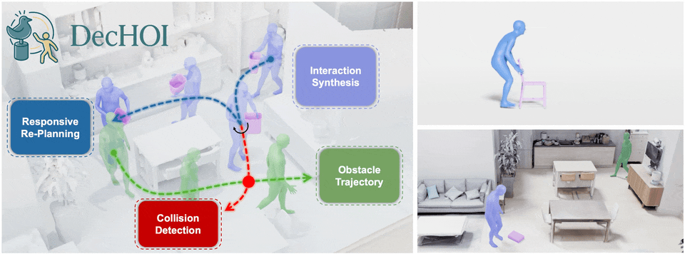

# DecHOI: Decoupled Generative Modeling for Human-Object Interaction Synthesis

🚀 Official PyTorch implementation of the CVPR 2026 paper **Decoupled Generative Modeling for Human-Object Interaction Synthesis (CVPR 2026)**

[\[ArXiv\]](https://arxiv.org/abs/2512.19049)

Hwanhee Jung, Seunggwan Lee, Jeongyoon Yoon, SeungHyeon Kim, Giljoo Nam, Qixing Huang, Sangpil Kim

<div align="center">
  
</div>

<br>

## Environment

> The verified environment is Python 3.10, CUDA 11.7, and PyTorch 2.0.1.

Create and activate the Anaconda environment:
```bash
conda create -n dechoi_env python=3.10
conda activate dechoi_env
```

Install PyTorch:
```bash
pip install --index-url https://download.pytorch.org/whl/cu117 torch==2.0.1 torchvision==0.15.2 torchaudio==2.0.2
```

Install PyTorch3D:
```bash
conda install -c fvcore -c iopath -c conda-forge fvcore iopath
conda install -c bottler nvidiacub
pip install --no-index --no-cache-dir pytorch3d==0.7.4 -f https://dl.fbaipublicfiles.com/pytorch3d/packaging/wheels/py310_cu117_pyt201/download.html
```

Install human_body_prior:
```bash
git clone https://github.com/nghorbani/human_body_prior.git
pip install tqdm dotmap PyYAML omegaconf loguru
cd human_body_prior/
python setup.py develop
```

Install BPS and Chamfer distance:
```bash
pip install git+https://github.com/otaheri/chamfer_distance.git
pip install git+https://github.com/otaheri/bps_torch.git
```

Install remaining dependencies:
```bash
pip install -r requirements.txt
```

## Prerequisites

Download [SMPL-X](https://smpl-x.is.tue.mpg.de/index.html) and place the model under `data/smpl_all_models/`.

Download the processed data from the previous work [CHOIS](https://github.com/lijiaman/chois_release?tab=readme-ov-file) and place it under `data/processed_data/`. You can override this path by setting the `DATA_ROOT_FOLDER` environment variable.

To generate visualizations, install [Blender](https://www.blender.org/download/) and set the following environment variables as needed:
```bash
export DECHOI_BLENDER_PATH=/path/to/blender
export DECHOI_BLENDER_UTILS_ROOT=manip/vis
export DECHOI_BLENDER_SCENE_FOLDER=/path/to/blender_files
```

## Pretrained Weights

You can download the pretrained DecHOI checkpoint from the link below:

- [weight link](https://kuaicv.synology.me/weights/cvpr2026/DecHOI/dechoi_final.pt)

## Common Commands

Evaluate the model:
```bash
sh scripts/test_dechoi_single_window.sh
```

You can override the defaults with environment variables:
```bash
DATA_ROOT_FOLDER=/path/to/data \
PRETRAINED_MODEL=/path/to/checkpoint.pt \
SAVE_RES_FOLDER=/path/to/output \
sh scripts/test_dechoi_single_window.sh
```

To toggle visualization output, set `save_obj_only` in the `gen_vis_res_generic()` method of `trainer_dechoi.py`.

Train:
```bash
sh scripts/train_dechoi.sh
```

Override training defaults:
```bash
DATA_ROOT_FOLDER=/path/to/data \
EXP_NAME=my_experiment \
sh scripts/train_dechoi.sh
```

## Citation
If you find this project useful, please consider citing:

```
@InProceedings{Jung_2026_CVPR,
    author    = {Jung, Hwanhee and Lee, Seunggwan and Yoon, Jeongyoon and Kim, SeungHyeon and Nam, Giljoo and Huang, Qixing and Kim, Sangpil},
    title     = {Decoupled Generative Modeling for Human-Object Interaction Synthesis},
    booktitle = {Proceedings of the IEEE/CVF Conference on Computer Vision and Pattern Recognition (CVPR)},
    month     = {June},
    year      = {2026},
    pages     = {2253-2263}
}
```

## Related Repos
We thank the fantastic works [T2M](https://github.com/EricGuo5513/text-to-motion), [OMOMO](https://github.com/lijiaman/omomo_release), [CHOIS](https://github.com/lijiaman/chois_release?tab=readme-ov-file), and [HOIFHLI](https://github.com/zhenkirito123/hoifhli_release) for their pioneer code release, which provide codebase for this benchmark.
